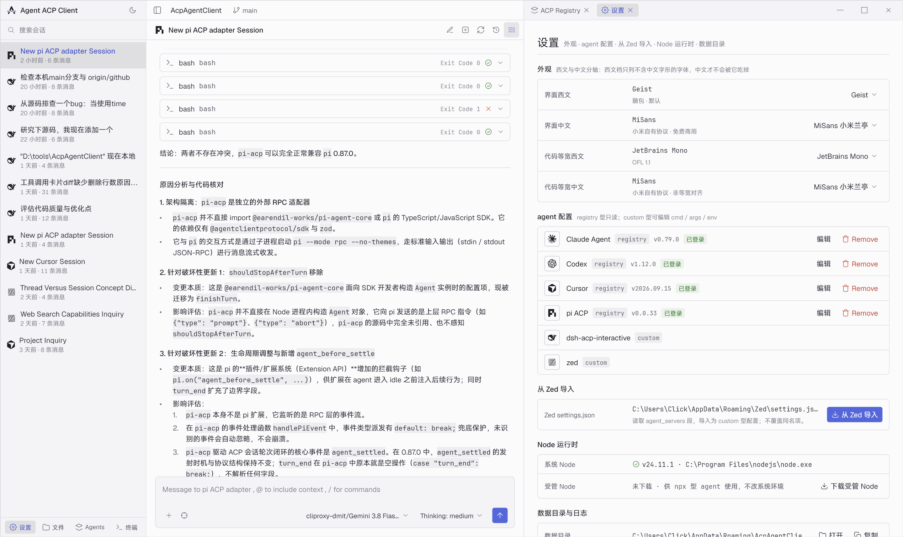
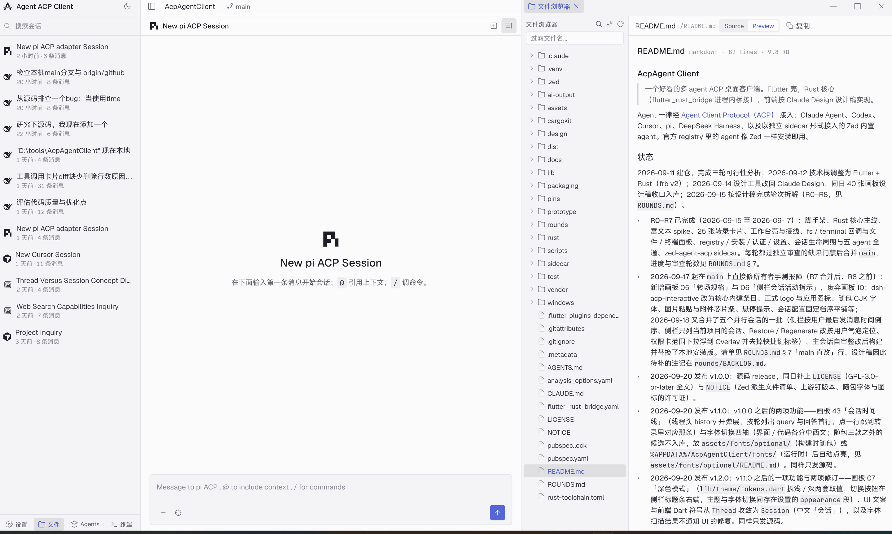
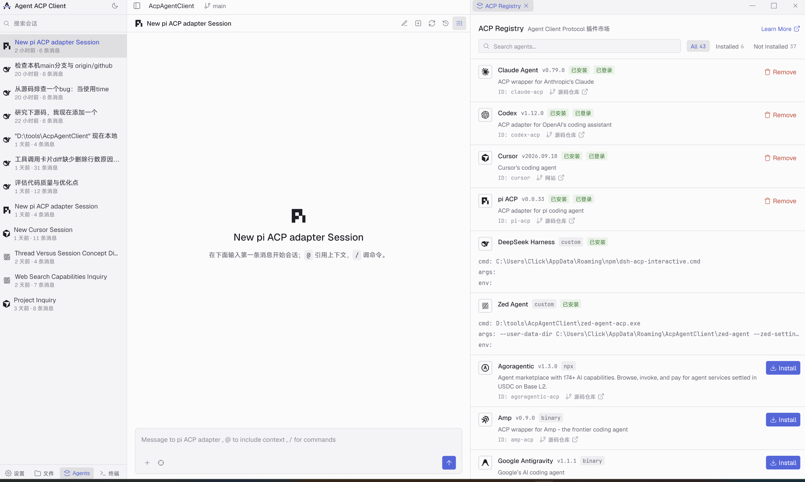

# AcpAgent Client

> 一个好看的多 agent 桌面客户端：所有 agent 都经 [Agent Client Protocol（ACP）](https://agentclientprotocol.com/) 接入，官方 registry 里的 agent 装上即用。

Claude Agent、Codex、Cursor、pi、DeepSeek Harness 共用同一个界面 —— 同一套转录卡片、同一个文件与终端面板、同一套权限与认证流程；Zed 的内置 agent 也能用（以随包的 sidecar 形式接入）。Flutter 壳 + Rust 核心（进程内 cdylib，经 flutter_rust_bridge v2 桥接），界面按 Claude Design 设计稿逐画板实现。



*会话工作台。左：当前项目的会话；中：转录（这里是几张终端工具调用卡与富文本正文）；右：设置面板。*

## 功能

以「会话工作台」为中心，功能边界就是设计稿（45 张画板的源与 PNG 基准见 [`design/README.md`](design/README.md)）：

- **转录** —— markdown 正文（代码高亮 / GFM 表格 / Mermaid / 数学公式）、思考折叠块、工具调用卡（含失败与取消）、文件 diff、嵌入式终端、子代理委派、计划、上下文压缩、图片 / 音频 / 资源内容块；整个回合可折叠，回合末尾给 token 用量、花费与耗时。
- **输入框** —— `@` 引用上下文、`/` 调命令、图片粘贴与附件芯片、会话配置（mode / model / thought level 等由 agent 自己声明）、上下文窗口占用浮窗。
- **权限与交互** —— 权限授权卡（带范围选择）、表单与链接跳转两种 elicitation、Awaiting Confirmation。
- **会话** —— 侧栏按「用户最后发消息时间」倒序、只列当前项目的会话；运行中有扫掠指示、跑完有未读点；会话时间线弹层按轮跳转；用户气泡上可 Restore / Regenerate。
- **右栏四个标签** —— 文件浏览器（源码 / 预览）、终端、Agents、设置。
- **Agents** —— 拉官方 registry，`npx` 与 `binary` 两种分发（binary 校验 sha256），缺 Node 时下载受管 Node；Agent Auth（agent 自己开浏览器）与 Terminal Auth（内置终端跑登录命令）两种认证都实现；可从 Zed 的 `settings.json` 导入 agent 配置。
- **外观** —— 浅色 / 深色 / 跟随系统三档主题；界面与代码字体各分中西文，四个轴独立切换。
- **调试** —— ACP 流量面板，逐条看脱敏后的原始 JSON-RPC 行，同源落 `logs/acp-<日期>.log`。



*右栏的文件浏览器：按工作区列目录，选中的文件给 Source / Preview 两种视图。*

## 支持的 agent



registry 里的条目都能装（截图时 43 条），下面这六个是重点验证过的一等公民（「安装 → 认证 → 新会话 → 含工具调用与权限的一轮 → 终端 → 取消 → 重开加载历史」全通）：

| agent | 分发 | 认证 |
|---|---|---|
| Claude Agent（`claude-agent-acp`） | npx | Agent Auth / Terminal Auth，也认环境变量 |
| Codex（`codex-acp`） | npx（内置 codex 二进制） | ChatGPT 登录走 URL elicitation，或 `OPENAI_API_KEY` |
| Cursor（`agent acp`） | binary（六平台压缩包） | `agent login`（Terminal Auth）或 `--api-key` |
| pi（`pi-acp`） | npx | Terminal Auth `--terminal-login` |
| DeepSeek Harness（`dsh-acp-interactive`） | 核心内建条目，免配置 | Terminal Auth `--setup` |
| Zed Agent（`zed-agent-acp`） | 随安装包分发的 sidecar | 只读沿用本机 Zed 的模型与密钥配置 |

## 安装

**Windows x64**，从 [Releases](https://github.com/ClickPM/AcpAgentClient/releases) 取一件：

| 产物 | 说明 |
|---|---|
| `AcpAgentClient-<版本>-setup.exe` | per-user 安装器，装进 `%LOCALAPPDATA%\Programs\AcpAgentClient`，免 UAC。**未签名**，SmartScreen 首次会拦，走「更多信息 → 仍要运行」 |
| `AcpAgentClient-<版本>-windows-x64.zip` | 免安装，解压即用，含 Zed Agent sidecar |
| `AcpAgentClient-<版本>-windows-x64-nosidecar.zip` | 同上但不含 sidecar，小 60 多 MB；代价是 agent 列表里没有 Zed Agent |

npx 型的 agent 需要系统 Node ≥ 22；没有的话应用会自己下一份受管 Node。

用户数据在 `%APPDATA%\AcpAgentClient\`（`settings.json`、会话索引、已安装的 agent、日志），安装与卸载都不动它。

**macOS 与 Linux 还没有构建**，见下面「状态」。

### 上手

1. 顶栏切到一个项目目录 —— 会话与文件面板都以它为工作区。
2. 右栏 **Agents** → 装一个 agent → 按卡片提示认证（浏览器或内置终端）。
3. 新建会话，发第一条消息。

## 从源码构建

前置：Rust stable、Flutter stable、`flutter_rust_bridge_codegen`、VS 2022「使用 C++ 的桌面开发」工作负载、Node ≥ 22。上游源码按 [`pins/upstream.json`](pins/upstream.json) 钉版本，不入库，先拉下来：

```powershell
powershell -File scripts/fetch-upstream.ps1          # 首次填充 vendor/upstream/
powershell -File scripts/fetch-upstream.ps1 -Check   # 验证钉版本
```

Git Bash 用 `scripts/fetch-upstream.sh [--check]`。然后：

```powershell
powershell -File scripts/validate.ps1          # 编译 + 测试 + 契约检查（-Quick 只跑静态检查）
powershell -File scripts/build.ps1             # flutter build windows --release
powershell -File scripts/build-sidecar.ps1     # Zed Agent sidecar（独立 workspace，冷编译约 50 分钟）
powershell -File scripts/package.ps1           # 打包 zip 与安装器 → dist/
```

产物在 `build/windows/x64/runner/Release/`；sidecar 先落 `build/sidecar/`，再由 CMake install 规则放到应用目录旁 —— 缺了不报错，只是 agent 列表里没有 Zed Agent。

项目路径含中文或空格时只能用 `scripts/build.ps1`（裸 `flutter build windows` 会把路径转码坏）。更多前置与本机坑见 [`CLAUDE.md`](CLAUDE.md)「本地开发」；各脚本的一句话索引在 [`scripts/README.md`](scripts/README.md)，测试布局在 [`test/README.md`](test/README.md)。

## 状态

当前 **v1.4.5**，Windows x64。逐版本的改动见 [Releases](https://github.com/ClickPM/AcpAgentClient/releases)；开发轮次与进度表在 [`ROUNDS.md`](ROUNDS.md)。2026-09-22 起 R0–R8 主体完成、进入敏捷迭代阶段：日常的缺陷修复、交互优化与单画板功能按 [`iterations/`](iterations/README.md) 的迭代流程走（一迭代一文件、一项一行、一轮审查），轮次流程保留给核心大迭代。

v1.4.5 关掉 BACKLOG P0 余下的七条（本地状态文件的读改写加进程内写锁；终端输出超过 64 K 字符后画面不再冻住、agent 读大文件改为流式、每条连接的终端数设上限；两个 agent 同时在线时权限 / 表单卡不再串、并跑时 Restore 不再让停止键消失、删掉正在跑的会话先 `session/cancel`），P1「流式渲染性能」两条（大 diff 卡线性 diff + 惰性展开体；长回答只重解析尾部、代码块高亮缓存），以及内置 DeepSeek Harness 升到 1.3.2（会话存到 `~/.dsh/acp-sessions`，不再跟着进程工作目录走）。各批合并前各自经 cursor 审查到 0 条（[`iterations/`](iterations/README.md) 的 iteration-10 ～ 13、[`rounds/round-dsh-1.3.2`](rounds/round-dsh-1.3.2/round-dsh-1.3.2.md)）。

v1.4.4 带来 BACKLOG P0「会话身份与生命周期」四条（载会话中途失败不再留半份转录；发消息按会话相对当前连接的状态分流，不再静默顶掉选中的会话；重载或崩溃之后同一 agent 名下的其它会话自动挂回再发；认证期间换了项目，认证完成后建出来的会话不再挂到旧目录）、画板 09「等你处理」（后台 / 换走的会话挂着权限或表单请求时，侧栏条目出「待授权 / 待输入」、项目切换器出等你数徽标）、壳级 toast（各处原先只进日志的失败摆到前台；点开旧会话时的「会话正在加载中」）、主题跟随系统（侧栏按钮三档循环）、终端里看得见正在组的字，以及退出时连还在握手的 agent 一起回收。发版前由主会话把 `v1.4.3..main` 的代码改动整体复审一遍、cursor 四轮复审到 0 条收口（[`rounds/round-1.4.4`](rounds/round-1.4.4/round-1.4.4.md)）。

v1.4.3 带来画板 53 的 registry 检查与升级（Agents 面板标题行「检查更新」；已安装条目有新版本时一键 Update，新版本装在旧版旁边、通过了才切换，失败或取消旧版本原样可用，运行中的连接提示「已升级 · 待重载」）、输入框加路径的两条新路（`+` → Files & Directories 改走 `@` 菜单、目录也能选；Ctrl+V 粘贴资源管理器里复制的文件与目录按路径引用）、两条所有者报障（最大化窗口最小化再还原后画面溢出屏幕；终端面板空格后打的字看不见），以及 BACKLOG P5 整档收尾。发版前由主会话把 `v1.4.2..main` 的代码改动整体复审一遍、cursor 两轮全量复审 0 条收口（[`rounds/round-1.4.3`](rounds/round-1.4.3/round-1.4.3.md)）。

还没做的：macOS 与 Linux 构建、安装包签名。跨轮次的待办与待裁定项在 [`rounds/BACKLOG.md`](rounds/BACKLOG.md)。

## 架构

```
Flutter 宿主进程（Dart 前端 ⇄ frb v2 ⇄ Rust 核心 cdylib）
   │ stdio · ACP JSON-RPC
   ├── claude-agent-acp / codex-acp / pi-acp     npx
   ├── cursor `agent acp`                        binary
   ├── dsh-acp-interactive                       custom（核心内建条目，免配置）
   └── zed-agent-acp                             sidecar（headless gpui + Zed 内置 agent，随包分发）
```

三条贯穿始终的约束：主进程里没有 gpui（要 gpui 的东西只能进 sidecar）；前端只消费 ACP 线上消息的原样 JSON、不给任何 agent 做特判；registry、安装、认证、终端与 fs 回调都在 Rust 核心。

## 文档

| 文件 | 内容 |
|---|---|
| [`docs/background.md`](docs/background.md) | 为什么做：前作、为什么是 ACP、为什么是 Flutter + Rust |
| [`docs/requirements.md`](docs/requirements.md) | 范围的权威定义：必须 / 不做 / 依赖白名单 |
| [`docs/design.md`](docs/design.md) | 进程模型、核心与前端契约、认证、registry、终端与 fs、sidecar、数据目录 |
| [`docs/acp-projection.md`](docs/acp-projection.md) | 可投影内容清单：15 个 `session/update` 变体、能力门、客户端必须自造的 8 项 |
| [`docs/research.md`](docs/research.md) | 源码级研究结论：Zed 的 ACP 代码、rust-sdk、registry、五个 agent、被排除的路线 |
| [`design/README.md`](design/README.md) | 画板索引：每张画板的 `.dc.html` 源、PNG 基准与实现状态 |
| [`iterations/README.md`](iterations/README.md) | 敏捷迭代流程（2026-09-22 起的日常模式）与迭代清单；轮次流程保留给核心大迭代 |
| [`CLAUDE.md`](CLAUDE.md) | 开发约定、轮次与迭代两条流程、硬性规则（`AGENTS.md` 是给审查者的指针） |

## 许可证

**GPL-3.0-or-later**，全文见 [`LICENSE`](LICENSE)。开源、不商用。

许可证由复用 Zed 源码决定：`rust/` 与 `sidecar/` 里共 15 个文件是 Zed 的复制改写或转写，各自文件头标注了上游路径与 commit，汇总在 [`NOTICE`](NOTICE) —— 那里同时列出 ACP 规范 / rust-sdk / registry（Apache-2.0）、随包字体（OFL-1.1）与图标的来源，以及商标声明。
